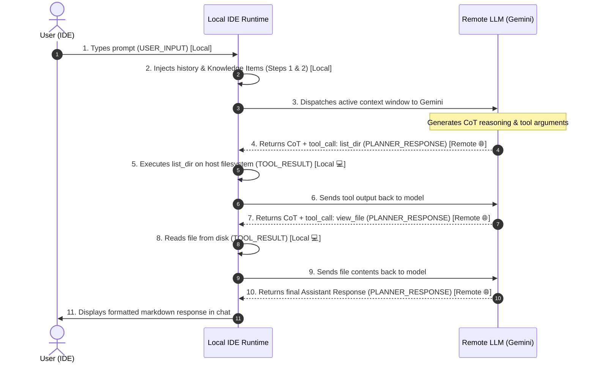

# Antigravity IDE Storage Formats

This document describes how Antigravity IDE stores conversation trajectories, Chain of Thought (CoT), tool calls, and planning artifacts on macOS and Linux.

## Overview

Antigravity stores data under `~/.gemini/antigravity-ide/` (or `~/.gemini/antigravity/`):

```
~/.gemini/antigravity-ide/
├── conversations/
│   ├── <conversation-id>.db          # SQLite trajectory database
│   ├── <conversation-id>.db-wal      # SQLite WAL journal (indicates active session)
│   └── <conversation-id>.db-shm      # Shared memory index
│
└── brain/
    └── <conversation-id>/
        ├── implementation_plan.md    # Planning document
        ├── walkthrough.md            # Post-execution walkthrough
        ├── scratch/                  # Temporary scripts & data
        └── .system_generated/
            └── logs/
                ├── transcript_full.jsonl  # Untruncated full step log
                └── transcript.jsonl       # Token-efficient truncated log
```

---

## 1. SQLite Database Store (`conversations/<id>.db`)

Every session has a dedicated SQLite database configured with `PRAGMA journal_mode = wal`.

### Tables Schema
- **`trajectory_meta`**:
  - `trajectory_id` (TEXT, PRIMARY KEY): Conversation GUID.
  - `cascade_id` (TEXT)
  - `trajectory_type` (INTEGER)
  - `source` (INTEGER)
- **`steps`**:
  - `idx` (INTEGER, PRIMARY KEY): Monotonically increasing step number.
  - `step_type` (INTEGER): Internal numeric step type.
  - `status` (INTEGER): Status code.
  - `has_subtrajectory` (NUMERIC)
  - `metadata` (BLOB): Protobuf-serialized metadata.
  - `error_details` (BLOB)
  - `permissions` (BLOB)
  - `task_details` (BLOB)
  - `render_info` (BLOB)
  - `step_payload` (BLOB): Protobuf-serialized payload containing tools, thoughts, and message frames.
  - `step_format` (INTEGER)
- **`gen_metadata`**:
  - `idx` (INTEGER, PRIMARY KEY)
  - `data` (BLOB): Generation metadata (tokens, timings, session IDs).
  - `size` (INTEGER)
- **`trajectory_metadata_blob`**:
  - `id` (TEXT DEFAULT 'main')
  - `data` (BLOB)

---

## 2. JSONL Transcript Store (`brain/<id>/.system_generated/logs/`)

`transcript_full.jsonl` contains line-by-line JSON records written incrementally as the session runs:

### Record Structure

```json
{
  "step_index": 3,
  "source": "MODEL",
  "type": "PLANNER_RESPONSE",
  "status": "DONE",
  "created_at": "2026-09-23T17:41:52Z",
  "thinking": "Initial assessment: Four issues require investigation...",
  "tool_calls": [
    {
      "name": "view_file",
      "args": {
        "AbsolutePath": "/path/to/file.py",
        "StartLine": 40,
        "EndLine": 90,
        "toolAction": "Viewing file",
        "toolSummary": "Check validate_task_config"
      }
    }
  ]
}
```

### Key Fields:
- **`thinking`**: The model's Chain of Thought (CoT). Present in `PLANNER_RESPONSE` steps.
- **`tool_calls`**: List of tool invocations declaring the tool name and argument dictionary.
- **`content`**:
  - In `USER_INPUT`: Contains user request wrapped in `<USER_REQUEST>...</USER_REQUEST>` and environment metadata.
  - In tool outputs (`VIEW_FILE`, `RUN_COMMAND`, etc.): The raw stdout or tool execution result.
  - In assistant responses: The user-facing final markdown response.
  - In `CHECKPOINT`: The compaction summary injected when context limits are reached.

---

## 3. Metric Computation & Estimation Methodologies

This section provides a rigorous mathematical and algorithmic explanation of how every metric, number, and counter displayed across `gmon` is obtained and calculated.

---

### 3.1 Character Counts & Token Estimation (BPE Ratio)

Antigravity logs raw string payloads in `transcript_full.jsonl` and SQLite blobs, but does not serialize raw BPE token IDs directly into JSON keys. `gmon` calculates token metrics using the industry-standard Byte-Pair Encoding (BPE) ratio for modern frontier LLMs (Gemini, Claude, GPT-4):

1. **Character Counts ($\text{chars}$)**:
   $$\text{chars} = \text{length}(S)$$
   Measured across UTF-8 encoded text for system instructions, tool schemas, user requests, CoT thinking, tool results, and assistant messages.

2. **Estimated Token Counts ($\text{tokens}$)**:
   Frontier tokenizers average **~4 characters per token** for natural language and markdown, and ~3.2 to 4.0 characters per token for source code and JSON. `gmon` applies ceiling division:
   $$\text{tokens} = \left\lceil \frac{\text{chars}}{4.0} \right\rceil = \left\lfloor \frac{\text{chars} + 3}{4} \right\rfloor$$

---

### 3.2 Active Context Window vs. Cumulative Session Tokens

Antigravity operates a dynamic sliding context window with state compaction:

1. **Compaction Boundary Identification ($C_{\text{latest}}$)**:
   - `gmon` scans the conversation trajectory for compaction records:
     $$\mathcal{C} = \{ s \mid \text{record}[s].\text{type} == \text{"CHECKPOINT"} \}$$
   - The active context boundary $C_{\text{latest}}$ is the maximum step in $\mathcal{C}$ (or $0$ if uncompacted):
     $$C_{\text{latest}} = \max(\mathcal{C}) \quad (\text{or } 0 \text{ if } \mathcal{C} = \emptyset)$$

2. **Active Context Tokens ($\text{Tokens}_{\text{active}}$)**:
   - Represents the exact volume of tokens currently loaded into Gemini's active attention window.
   - Any message frames with $\text{step\_index} < C_{\text{latest}}$ have been pruned away from model memory and are excluded:
     $$\text{Tokens}_{\text{active}} = \text{Tokens}_{\text{system}} + \text{Tokens}_{\text{tools}} + \sum_{f \in \text{Frames}, \, f.\text{step\_index} \ge C_{\text{latest}}} f.\text{est\_tokens}$$

3. **Cumulative Session Tokens ($\text{Tokens}_{\text{session}}$)**:
   - Measures the total lifetime compute and context generated across the entire session lifecycle, preserving all pre-compaction turns:
     $$\text{Tokens}_{\text{session}} = \text{Tokens}_{\text{system}} + \text{Tokens}_{\text{tools}} + \sum_{f \in \text{All Frames}} f.\text{est\_tokens}$$

---

### 3.3 Semantic Category Classification & Percentage Breakdown

Every message frame, system directive, and tool schema is classified into one of 8 mutually exclusive categories:

| Category Key | Display Label | Origin & Extraction Source |
| :--- | :--- | :--- |
| `system_instruction` | 🧠 System Prompt & Guidelines | Static base persona, identity, behavioral guidelines, and rules parsed from protobuf generation snapshots or system prefix. |
| `skills_plugins` | 🧩 Skills & Plugins Catalog | Custom skills and plugins injected into `<skills>...</skills>` and `<plugins>...</plugins>` tags. |
| `tool_declarations` | 🛠️ Tool Declarations | JSON parameter schemas and descriptions of all tools exposed to the agent. |
| `compaction_summary` | ⚙️ Compaction Summary | `# Resuming from a compaction` state summaries injected at `CHECKPOINT` steps. |
| `user_prompts` | 👤 User Requests & IDE State | User text (`<USER_REQUEST>`), active document, cursor line, open tabs, and running terminal commands (`<ADDITIONAL_METADATA>`). |
| `cot_reasoning` | 🧠 Chain of Thought | Internal reasoning tokens extracted from the `thinking` field of `PLANNER_RESPONSE` steps. |
| `tool_outputs` | 🛠️ Tool Calls & Results | JSON tool call proposals (`tool_calls`) plus execution outputs/stdout/stderr from tool execution steps (`RUN_COMMAND`, `VIEW_FILE`, etc.). |
| `assistant_responses` | 🤖 Assistant Responses | User-facing formatted markdown messages returned by the model. |
| `system_history` | 📜 Conversation History & KIs | Injected past conversation summaries (`<conversation_summaries>`) and matched knowledge items (`<knowledge_items>`). |

**Category Percentage Calculation**:
$$\text{Percentage}(c) = \frac{\text{Tokens}(c)}{\text{Tokens}_{\text{active}}} \times 100\%$$

---

### 3.4 Step-by-Step Time-Series Evolution Math

For each step $t \in [0, N]$:

1. **Step Delta ($\Delta_t$)**:
   $$\Delta_t = \sum_{f \in \text{Frames}(t)} f.\text{est\_tokens}$$

2. **Active Tokens at Step $t$ ($\text{Active}(t)$)**:
   - If step $t$ is a compaction checkpoint ($t \in \mathcal{C}$):
     $$\text{Active}(t) = \text{Tokens}_{\text{system}} + \text{Tokens}_{\text{tools}} + \text{Tokens}_{\text{compaction\_summary}}(t)$$
   - If step $t$ is a normal step ($t \notin \mathcal{C}$):
     $$\text{Active}(t) = \text{Active}(t-1) + \Delta_t$$

3. **Cumulative Tokens at Step $t$ ($\text{Cumulative}(t)$)**:
   $$\text{Cumulative}(t) = \text{Tokens}_{\text{system}} + \text{Tokens}_{\text{tools}} + \sum_{i=0}^t \Delta_i$$

---

### 3.5 Latency, Timings & Analytics Counters

1. **Step Timestamps**: Parsed from ISO 8601 UTC strings (`created_at`). Displayed formatted in user local time (`HH:MM:SS`).
2. **Tool Execution Latencies**: Captured by the IDE runtime and extracted from `duration_seconds` or elapsed step deltas (e.g. `⏱️ 1.2s`).
3. **Chain of Thought Latencies**: Inferred duration of model inference token streaming.
4. **Tool Invocations Histogram**:
   $$\text{ToolCount}(\text{tool\_name}) = \sum \mathbb{I}(\text{tc.name} == \text{tool\_name})$$
5. **Touched Files Tracker**:
   - Parsed by analyzing arguments (`AbsolutePath`, `TargetFile`, `CommandLine` file patterns) across `write_to_file` (create), `replace_file_content` (modify), and `run_command` operations.
6. **Error Counts**:
   - Incremented when `step.status == "ERROR"`, `exit_code != 0`, or tool stderr contains execution failures.
7. **Model Name Detection**:
   - Regex parsed from `USER_SETTINGS_CHANGE` logs:
     $$\text{Pattern: } \texttt{Changed setting \`Model Selection\` from \S+ to ([^.]+?)\.}$$
   - Accurately captures exact decimal version strings (e.g., `Gemini 3.8 Flash (Medium)`, `Gemini 3.7 Flash (Medium)`).

---


## 4. Agent Execution Lifecycle & Step Types (Remote vs. Local)

Not every step in `transcript.jsonl` is a call to the remote LLM. The agent operates in an alternating loop between **Purely Local IDE Operations** and **Remote LLM Inferences**.

### Step Classification Table

| Step Type | `source` | `type` | Execution Location | Description |
| :--- | :--- | :--- | :--- | :--- |
| **Model Generation / CoT** | `"MODEL"` | `"PLANNER_RESPONSE"` | 🌐 **Remote LLM** (Gemini API) | Sends active context to Gemini; receives Chain of Thought (`thinking`), tool proposals (`tool_calls`), or final assistant response (`content`). |
| **User Request** | `"USER_EXPLICIT"` | `"USER_INPUT"` | 💻 **Purely Local** | IDE captures user prompt, open files, cursor location, and background processes. |
| **Conversation History** | `"SYSTEM"` | `"CONVERSATION_HISTORY"` | 💻 **Purely Local** | IDE indexes past conversation metadata and prepares context summaries. |
| **Knowledge Items** | `"SYSTEM"` | `"KNOWLEDGE_ARTIFACTS"` | 💻 **Purely Local** | IDE queries local knowledge database (`~/.gemini/.../knowledge/`). |
| **Tool Execution** | `"SYSTEM"` / Tool | `"RUN_COMMAND"`, `"VIEW_FILE"`, etc. | 💻 **Purely Local** | IDE executes shell commands, file edits, or directory listings locally on the Mac host. |
| **Compaction Checkpoints** | `"SYSTEM"` | `"CHECKPOINT"` | 💻 **Purely Local** | Local runtime summarizes older turns when active context nears the budget limit. |

### Sequence Diagram



---

## 5. Time-Series Evolution & Compaction Sawtooth Analysis

`gmon` analyzes the temporal evolution of tokens throughout an entire session:

### Two Complementary Evolution Metrics
1. **Active Context Window ($\text{Tokens}_{\text{active}}$)**:
   - Tracks the exact token load present in Gemini's attention window at step $t$.
   - **Sawtooth Pattern**: Grows monotonically as tools execute and messages accumulate, until a `CHECKPOINT` compaction step occurs, triggering an instantaneous drop down to the summary baseline token count.
2. **Total Cumulative Session Tokens ($\text{Tokens}_{\text{cumul}}$)**:
   - Monotonically increasing sum of all input/output context processed across the conversation lifetime.

### Interactive Stacked Area Vector Chart
The chart visually breaks down each step into color-coded semantic layers:
- 🟣 `System Prompt & Guidelines`
- 🔵 `Tool Parameter Declarations`
- ⚪ `Compaction Summary Baseline`
- 🟢 `User Requests & IDE Environment State`
- 🧠 `Chain of Thought Reasoning`
- 🛠️ `Tool Call Requests & Execution Outputs`
- 🤖 `Assistant Messages`
- 📜 `Conversation History & Knowledge Items`

---

## 6. Point-in-Time Context Window Reconstruction

When inspecting an individual turn (e.g. via the `🌐 Remote` badge in the UI or `GET /api/conversations/{id}/context-at/{step_index}`), `gmon`:
1. Identifies the active compaction boundary $C \le \text{step\_index}$.
2. Gathers all active message frames in the range $[C, \text{step\_index}]$.
3. Extracts static system guidelines and tool schemas active for the session.
4. Computes token metrics and category percentage distributions.
5. Reconstructs the exact raw prompt text string sent over the wire to Gemini.

---

## 7. REST API Reference

The `gmon` backend exposes a high-performance REST API:

| Endpoint | Method | Response Type | Description |
| :--- | :--- | :--- | :--- |
| `/api/conversations` | `GET` | `list[ConversationSummary]` | List all scanned Antigravity sessions with live/idle indicators. |
| `/api/conversations/{id}` | `GET` | `ConversationDetail` | Complete chronological trajectory, CoTs, tool records, plan documents, and analytics. |
| `/api/conversations/{id}/stream` | `GET` | `text/event-stream` (SSE) | Real-time Server-Sent Events broadcasting new steps and file changes as they happen. |
| `/api/conversations/{id}/context` | `GET` | `ContextWindowReport` | Active context window metrics, compaction boundaries, frames list, and evolution. |
| `/api/conversations/{id}/context-at/{step}` | `GET` | `StepContextWindowReport` | Point-in-time active context window snapshot and reconstructed prompt text at a specific step. |
| `/api/conversations/{id}/evolution` | `GET` | `ContextEvolutionReport` | Step-by-step active and cumulative token series with breakdown points. |
| `/api/conversations/{id}/prompt` | `GET` | `ReconstructedPrompt` | Full prompt reverse-engineered into structured semantic sections and tool parameter schemas. |
| `/api/conversations/{id}/prompt/raw` | `GET` | `text/plain` | Raw text of the reconstructed prompt (supports `?download=true`). |
| `/api/artifacts/{id}/{filename}` | `GET` | Binary / Media | Serves session screenshots, webp recordings, and task logs. |


