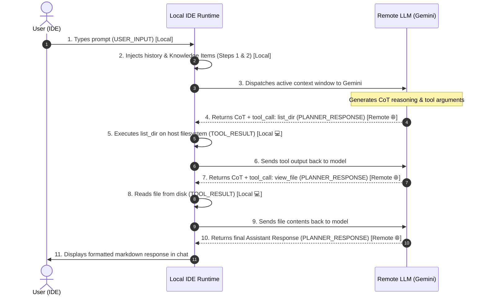

# Antigravity IDE Storage Formats

This document describes how Antigravity IDE stores conversation trajectories, Chain of Thought (CoT), tool calls, and planning artifacts on macOS and Linux.

## Overview

Antigravity stores data under `~/.gemini/antigravity-ide/` (or `~/.gemini/antigravity/`):

```
~/.gemini/antigravity-ide/
├── conversations/
│   ├── <conversation-id>.db          # SQLite trajectory database
│   ├── <conversation-id>.db-wal      # SQLite WAL journal (indicates active session)
│   └── <conversation-id>.db-shm      # Shared memory index
│
└── brain/
    └── <conversation-id>/
        ├── implementation_plan.md    # Planning document
        ├── walkthrough.md            # Post-execution walkthrough
        ├── scratch/                  # Temporary scripts & data
        └── .system_generated/
            └── logs/
                ├── transcript_full.jsonl  # Untruncated full step log
                └── transcript.jsonl       # Token-efficient truncated log
```

---

## 1. SQLite Database Store (`conversations/<id>.db`)

Every session has a dedicated SQLite database configured with `PRAGMA journal_mode = wal`.

### Tables Schema
- **`trajectory_meta`**:
  - `trajectory_id` (TEXT, PRIMARY KEY): Conversation GUID.
  - `cascade_id` (TEXT)
  - `trajectory_type` (INTEGER)
  - `source` (INTEGER)
- **`steps`**:
  - `idx` (INTEGER, PRIMARY KEY): Monotonically increasing step number.
  - `step_type` (INTEGER): Internal numeric step type.
  - `status` (INTEGER): Status code.
  - `has_subtrajectory` (NUMERIC)
  - `metadata` (BLOB): Protobuf-serialized metadata.
  - `error_details` (BLOB)
  - `permissions` (BLOB)
  - `task_details` (BLOB)
  - `render_info` (BLOB)
  - `step_payload` (BLOB): Protobuf-serialized payload containing tools, thoughts, and message frames.
  - `step_format` (INTEGER)
- **`gen_metadata`**:
  - `idx` (INTEGER, PRIMARY KEY)
  - `data` (BLOB): Generation metadata (tokens, timings, session IDs).
  - `size` (INTEGER)
- **`trajectory_metadata_blob`**:
  - `id` (TEXT DEFAULT 'main')
  - `data` (BLOB)

---

## 2. JSONL Transcript Store (`brain/<id>/.system_generated/logs/`)

`transcript_full.jsonl` contains line-by-line JSON records written incrementally as the session runs:

### Record Structure

```json
{
  "step_index": 3,
  "source": "MODEL",
  "type": "PLANNER_RESPONSE",
  "status": "DONE",
  "created_at": "2026-09-23T17:41:52Z",
  "thinking": "Initial assessment: Four issues require investigation...",
  "tool_calls": [
    {
      "name": "view_file",
      "args": {
        "AbsolutePath": "/path/to/file.py",
        "StartLine": 40,
        "EndLine": 90,
        "toolAction": "Viewing file",
        "toolSummary": "Check validate_task_config"
      }
    }
  ]
}
```

### Key Fields:
- **`thinking`**: The model's Chain of Thought (CoT). Present in `PLANNER_RESPONSE` steps.
- **`tool_calls`**: List of tool invocations declaring the tool name and argument dictionary.
- **`content`**:
  - In `USER_INPUT`: Contains user request wrapped in `<USER_REQUEST>...</USER_REQUEST>` and environment metadata.
  - In tool outputs (`VIEW_FILE`, `RUN_COMMAND`, etc.): The raw stdout or tool execution result.
  - In assistant responses: The user-facing final markdown response.
  - In `CHECKPOINT`: The compaction summary injected when context limits are reached.

---

## 3. Context Window Assembly & Token Estimation

### How the Context Window is Assembled

On every model invocation, the LLM context window is assembled from the message trajectory:

1. **System & Tool Directives**:
   - Injected system prompts, agent instructions, rules, and default tool signatures.
2. **Dynamic IDE State**:
   - Parsed from `<ADDITIONAL_METADATA>` in `USER_INPUT` steps (active document, cursor line, open tabs, background terminal processes).
3. **Cross-Session Memory**:
   - Injected summaries of the 14 most recent conversations (`<conversation_summaries>`) and knowledge items.
4. **Trajectory & Compaction Boundaries**:
   - **Uncompacted Sessions**: All turns from `step_index = 0` to the current step remain active in the LLM's context window.
   - **Compacted Sessions**: When the session exceeds the context budget, Antigravity inserts a `CHECKPOINT` compaction step (`# Resuming from a compaction`). The model's prompt is pruned: all turns prior to the last `CHECKPOINT` are dropped from active memory, and only the compaction summary + subsequent post-compaction turns are sent to the LLM.

### How Token Counts are Computed in `gmon`

Antigravity logs the full text payload of every message frame into `transcript_full.jsonl`, but does not serialize raw BPE token IDs directly into the JSONL keys. `gmon` calculates token metrics using standard Byte-Pair Encoding ratios:

1. **Character Counts**:
   ```python
   char_count = len(frame_content)
   ```

2. **Estimated Token Counts**:
   Modern LLM tokenizers (Gemini, Claude, GPT-4) average approximately **4 characters per token** for natural language and markdown, and ~3.2 to 4.0 characters per token for code/JSON. `gmon` applies ceiling division:
   ```python
   est_tokens = (char_count + 3) // 4  # ceil(char_count / 4.0)
   ```

3. **Active Context vs. Cumulative Session Tokens**:
   - **Active Context Tokens**:
     $$\text{Tokens}_{\text{active}} = \sum_{f \in \text{Frames}_{\ge \text{last\_checkpoint}}} f.\text{est\_tokens}$$
     Only includes frames currently within the model's active attention window.
   - **Total Cumulative Session Tokens**:
     $$\text{Tokens}_{\text{session}} = \sum_{f \in \text{All Frames}} f.\text{est\_tokens}$$
     Measures all compute and context generated across the entire session lifecycle, including pre-compaction turns.

4. **Component Breakdown**:
   Frames are aggregated into 6 categories:
   - **`compaction_summary`**: `# Resuming from a compaction` summaries
   - **`user_prompts`**: User requests, IDE tabs, cursor position, and background commands
   - **`cot_reasoning`**: Model's internal Chain of Thought thinking blocks
   - **`tool_outputs`**: Tool calls (JSON arguments) and execution stdout/stderr results
   - **`assistant_responses`**: Final markdown responses returned by the model
   - **`system_history`**: Recent conversation summaries and knowledge items

---

## 4. Agent Execution Lifecycle & Step Types (Remote vs. Local)

Not every step in `transcript.jsonl` is a call to the remote LLM. The agent operates in an alternating loop between **Purely Local IDE Operations** and **Remote LLM Inferences**.

### Step Classification Table

| Step Type | `source` | `type` | Execution Location | Description |
| :--- | :--- | :--- | :--- | :--- |
| **Model Generation / CoT** | `"MODEL"` | `"PLANNER_RESPONSE"` | 🌐 **Remote LLM** (Gemini API) | Sends active context to Gemini; receives Chain of Thought (`thinking`), tool proposals (`tool_calls`), or final assistant response (`content`). |
| **User Request** | `"USER_EXPLICIT"` | `"USER_INPUT"` | 💻 **Purely Local** | IDE captures user prompt, open files, cursor location, and background processes. |
| **Conversation History** | `"SYSTEM"` | `"CONVERSATION_HISTORY"` | 💻 **Purely Local** | IDE indexes past conversation metadata and prepares context summaries. |
| **Knowledge Items** | `"SYSTEM"` | `"KNOWLEDGE_ARTIFACTS"` | 💻 **Purely Local** | IDE queries local knowledge database (`~/.gemini/.../knowledge/`). |
| **Tool Execution** | `"SYSTEM"` / Tool | `"RUN_COMMAND"`, `"VIEW_FILE"`, etc. | 💻 **Purely Local** | IDE executes shell commands, file edits, or directory listings locally on the Mac host. |
| **Compaction Checkpoints** | `"SYSTEM"` | `"CHECKPOINT"` | 💻 **Purely Local** | Local runtime summarizes older turns when active context nears the budget limit. |

### Sequence Diagram



---

## 5. Time-Series Evolution & Compaction Sawtooth Analysis

`gmon` analyzes the temporal evolution of tokens throughout an entire session:

### Two Complementary Evolution Metrics
1. **Active Context Window ($\text{Tokens}_{\text{active}}$)**:
   - Tracks the exact token load present in Gemini's attention window at step $t$.
   - **Sawtooth Pattern**: Grows monotonically as tools execute and messages accumulate, until a `CHECKPOINT` compaction step occurs, triggering an instantaneous drop down to the summary baseline token count.
2. **Total Cumulative Session Tokens ($\text{Tokens}_{\text{cumul}}$)**:
   - Monotonically increasing sum of all input/output context processed across the conversation lifetime.

### Interactive Stacked Area Vector Chart
The chart visually breaks down each step into color-coded semantic layers:
- 🟣 `System Prompt & Guidelines`
- 🔵 `Tool Parameter Declarations`
- ⚪ `Compaction Summary Baseline`
- 🟢 `User Requests & IDE Environment State`
- 🧠 `Chain of Thought Reasoning`
- 🛠️ `Tool Call Requests & Execution Outputs`
- 🤖 `Assistant Messages`
- 📜 `Conversation History & Knowledge Items`

---

## 6. Point-in-Time Context Window Reconstruction

When inspecting an individual turn (e.g. via the `🌐 Remote` badge in the UI or `GET /api/conversations/{id}/context-at/{step_index}`), `gmon`:
1. Identifies the active compaction boundary $C \le \text{step\_index}$.
2. Gathers all active message frames in the range $[C, \text{step\_index}]$.
3. Extracts static system guidelines and tool schemas active for the session.
4. Computes token metrics and category percentage distributions.
5. Reconstructs the exact raw prompt text string sent over the wire to Gemini.

---

## 7. REST API Reference

The `gmon` backend exposes a high-performance REST API:

| Endpoint | Method | Response Type | Description |
| :--- | :--- | :--- | :--- |
| `/api/conversations` | `GET` | `list[ConversationSummary]` | List all scanned Antigravity sessions with live/idle indicators. |
| `/api/conversations/{id}` | `GET` | `ConversationDetail` | Complete chronological trajectory, CoTs, tool records, plan documents, and analytics. |
| `/api/conversations/{id}/stream` | `GET` | `text/event-stream` (SSE) | Real-time Server-Sent Events broadcasting new steps and file changes as they happen. |
| `/api/conversations/{id}/context` | `GET` | `ContextWindowReport` | Active context window metrics, compaction boundaries, frames list, and evolution. |
| `/api/conversations/{id}/context-at/{step}` | `GET` | `StepContextWindowReport` | Point-in-time active context window snapshot and reconstructed prompt text at a specific step. |
| `/api/conversations/{id}/evolution` | `GET` | `ContextEvolutionReport` | Step-by-step active and cumulative token series with breakdown points. |
| `/api/conversations/{id}/prompt` | `GET` | `ReconstructedPrompt` | Full prompt reverse-engineered into structured semantic sections and tool parameter schemas. |
| `/api/conversations/{id}/prompt/raw` | `GET` | `text/plain` | Raw text of the reconstructed prompt (supports `?download=true`). |
| `/api/artifacts/{id}/{filename}` | `GET` | Binary / Media | Serves session screenshots, webp recordings, and task logs. |


